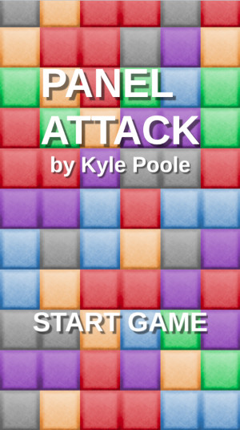
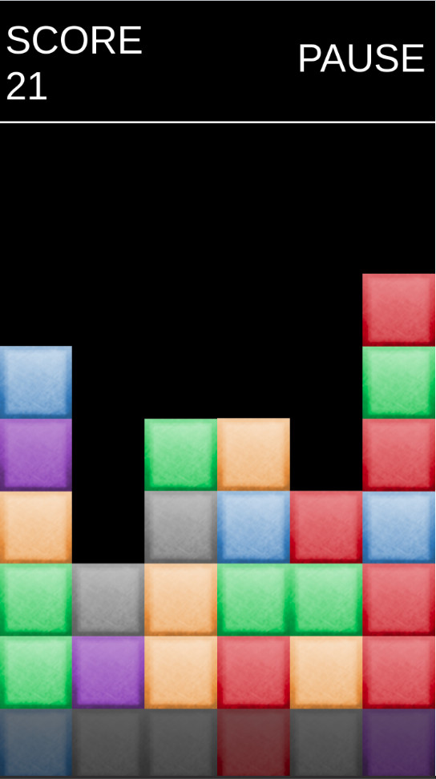

# Panel Attack

## About
Panel attack is a clone of [Tetris Attack/Panel De Pon](https://en.wikipedia.org/wiki/Tetris_Attack) written in JavaScript using PhaserJS.

* Blocks move up from the bottom of the screen and you have to try to clear them by making colour-matching combinations of 3 or greater.
*  Matches can be vertical or horizontal.
*  Move blocks by swiping them to the left or to the right.

Best played on a touch device.

### Don't want to clone and build it locally? [You can play it here.](http://floating-river-60550.herokuapp.com/)

## Installing and running
Assuming that you have nodejs and npm installed:

`npm install`

`npm run server:dev`

I used Richard Roylance's [Phaser NPM Webpack Typescript Starter Project](https://github.com/rroylance/phaser-npm-webpack-typescript-starter-project) as a starting point, so most of the documentation on that project applies here as well.
